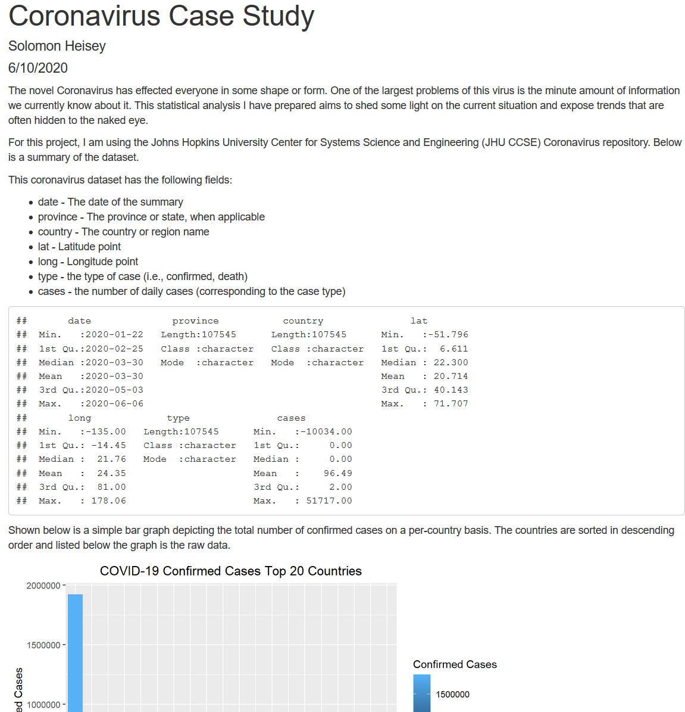

# Coronavirus-Case-Study
 A statistical analysis on the novel Coronavirus using R
 
 

  

 
 ## Installation
Installation of this repo is staightforward. Simply clone and navigate to the src folder. Here you will find the .rmd file containing all source code as well as the rendered HTML file.
 
 ## Author 
 * Solomon Heisey
